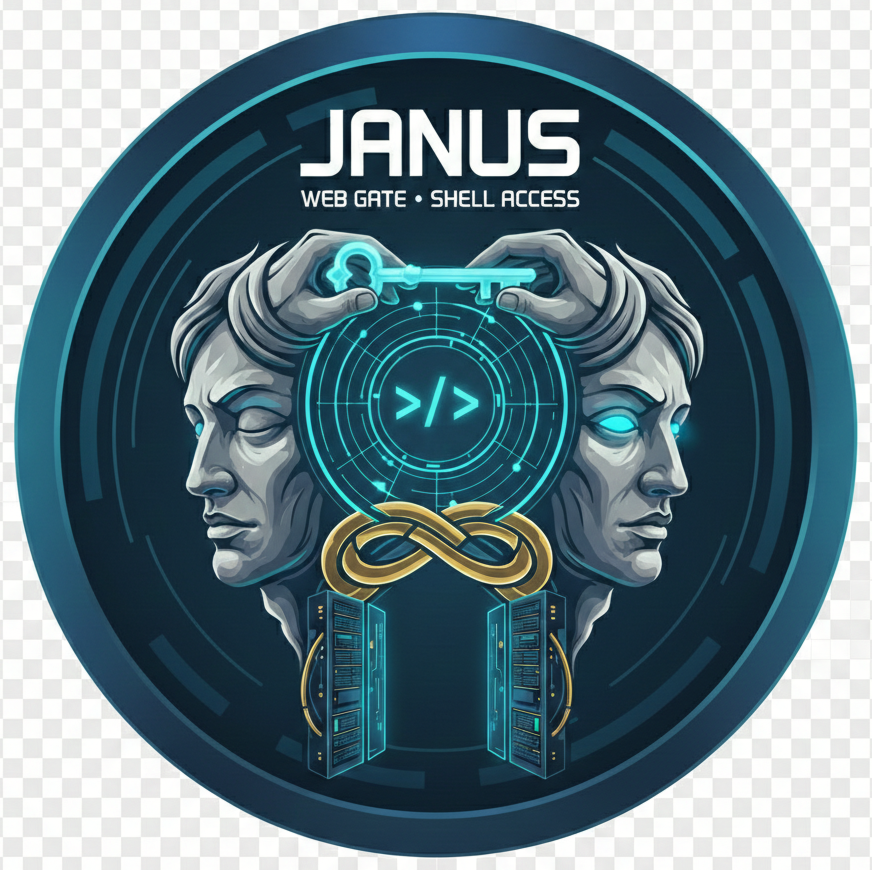

# Janus

<p align="center">
  
</p>

Gateway guardian to your terminal realm. A secure web-based terminal application with iMessage-based authentication. Designed for localhost use with optional public exposure via reverse proxies (ngrok, Cloudflare Tunnel).

## Features

- **Secure Authentication**: Token-based authentication via iMessage (no passwords stored)
- **Multiple Terminal Sessions**: Create and manage multiple terminal sessions
- **Real-time Terminal Streaming**: Bidirectional PTY streaming over WebSocket
- **Session Management**: Automatic cleanup of idle and dead sessions
- **Resource Safety**: Comprehensive testing for PTY cleanup and file descriptor management
- **Security First**:
  - Token-based authentication (no passwords)
  - CSRF protection with validation
  - TLS/HTTPS support with auto-generated certificates
  - Origin validation (localhost + configurable public origins)
  - Rate limiting on sensitive endpoints
  - Root execution prevention
  - Request body size limits
  - Session validation and automatic cleanup

## Quick Start

### Prerequisites

- Rust 1.70+ (for building)
- macOS (for iMessage notification support)
- Node.js 18+ (for frontend development)

### Building

```bash
# Build the backend
cargo build --release

# Build the frontend
cd frontend
npm install
npm run build
cd ..
```

### Configuration

Copy the example configuration:

```bash
cp config.example.toml config.toml
```

Edit `config.toml` to set your phone number for iMessage notifications:

```toml
bind_address = "127.0.0.1:8080"
max_sessions = 10
idle_timeout_secs = 3600
token_validity_secs = 300

[notification]
type = "imessage"
phone_number = "+1234567890"  # Your phone number

[rate_limit]
requests_per_period = 3
period_secs = 60

session_log_dir = "~/.web-terminal/session-logs"
use_https = false
```

### Running

```bash
# Start the server
./target/release/janus

# Or in development:
cargo run
```

The server will start on `http://127.0.0.1:8080` by default.

## Usage

1. **Request Token**: Navigate to `http://127.0.0.1:8080` and click "Request Token"
2. **Receive Token**: Check your iMessage for the authentication token
3. **Login**: Enter the token to authenticate
4. **Use Terminal**: Create and manage terminal sessions through the web interface

## Architecture

The application consists of three main components:

### Backend (Rust)

- **Axum Web Server**: HTTP/WebSocket handling
- **Token Store**: One-time token management with atomic operations
- **Session Manager**: PTY-backed terminal session lifecycle management
- **Session Logger**: Audit logging for all terminal I/O
- **Notification System**: iMessage integration for token delivery

### Frontend (React + TypeScript)

- **xterm.js**: Full-featured terminal emulator
- **WebSocket Client**: Real-time bidirectional communication
- **Session Management UI**: Create, switch, and delete sessions

### Protocol

- **Authentication**: One-time tokens (64-char hex) with 5-minute expiry
- **Session Cookies**: HTTP-only, SameSite=Strict cookies for session management
- **CSRF Tokens**: Per-session CSRF tokens sent in X-CSRF-Token header
- **WebSocket Messages**: JSON-based protocol for terminal I/O, resize, and control

See [ARCHITECTURE.md](ARCHITECTURE.md) for detailed design documentation.

## Public Exposure (Optional)

The application can be securely exposed via reverse proxies like ngrok for remote access:

```bash
# 1. Configure Janus for public use
# See config.example.toml for full options

# 2. Start Janus with HTTPS
./target/release/janus --config config.toml

# 3. Start ngrok
ngrok http --domain=your-domain.ngrok.io 8080
```

**⚠️ Important**: See [DEPLOYMENT.md](DEPLOYMENT.md) for complete security guidelines and configuration requirements before exposing to the internet.

## Security Considerations

**Primary use case: Localhost access**

For localhost use, the application is secure out of the box. For public exposure via reverse proxies, follow the guidelines in [DEPLOYMENT.md](DEPLOYMENT.md) and [SECURITY.md](SECURITY.md).

Key security features:

- Localhost-only binding (127.0.0.1)
- One-time authentication tokens
- Origin/Host validation
- CSRF protection
- Rate limiting
- Session isolation
- No root execution
- Comprehensive input validation

See [SECURITY.md](SECURITY.md) for detailed security documentation.

## Development

### Running Tests

```bash
# Run all tests
cargo test

# Run specific test suites
cargo test --lib                          # Library tests
cargo test --test pty_cleanup_tests       # PTY cleanup tests
cargo test --test fd_leak_tests           # File descriptor tests
```

### Frontend Development

```bash
cd frontend
npm run dev  # Starts Vite dev server with proxy to backend
```

### Project Structure

```
janus/
├── src/
│   ├── main.rs              # Binary entry point
│   ├── lib.rs               # Library root
│   ├── auth.rs              # Token generation and validation
│   ├── config.rs            # Configuration management
│   ├── session.rs           # Session manager and PTY handling
│   ├── session_logger.rs    # Audit logging
│   ├── websocket.rs         # WebSocket protocol
│   └── notification.rs      # iMessage integration
├── frontend/
│   ├── src/
│   │   ├── api/             # API client
│   │   └── components/      # React components
│   └── public/
├── tests/                   # Integration tests
└── static/                  # Built frontend assets
```

## Troubleshooting

### iMessage notifications not working

1. Ensure Messages app is running and signed in
2. Verify your phone number is correct in `config.toml`
3. Check that iMessage is enabled on your device
4. Look for errors in server logs

### Terminal sessions not starting

1. Check that `/bin/bash` or `$SHELL` is available
2. Verify you're not running as root
3. Check server logs for PTY errors

### WebSocket connection fails

1. Verify the session exists
2. Check that you're authenticated (have a valid session cookie)
3. Ensure the WebSocket URL matches the backend address
4. Look for Origin/Host validation errors in logs

## License

This project is for personal use and educational purposes.

## Contributing

This is a personal project, but suggestions and bug reports are welcome.

## Acknowledgments

- Built with [Axum](https://github.com/tokio-rs/axum)
- Terminal emulation via [xterm.js](https://xtermjs.org/)
- PTY handling with [portable-pty](https://github.com/wez/wezterm/tree/main/pty)
- Powered by [Rust](https://www.rust-lang.org/) and [React](https://react.dev/)
